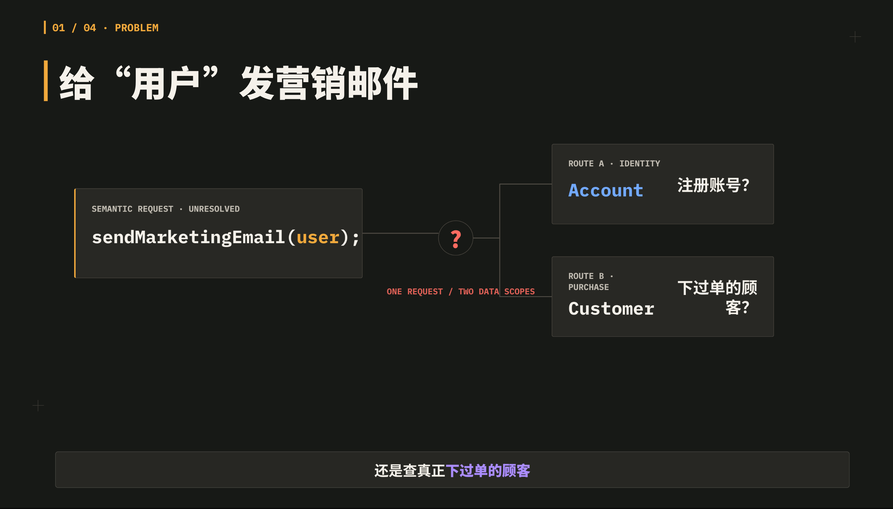
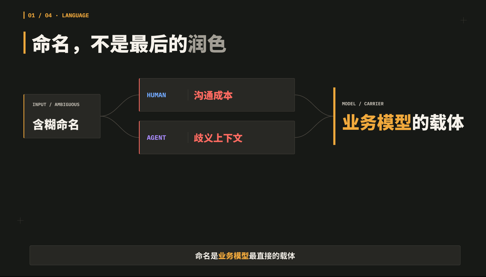
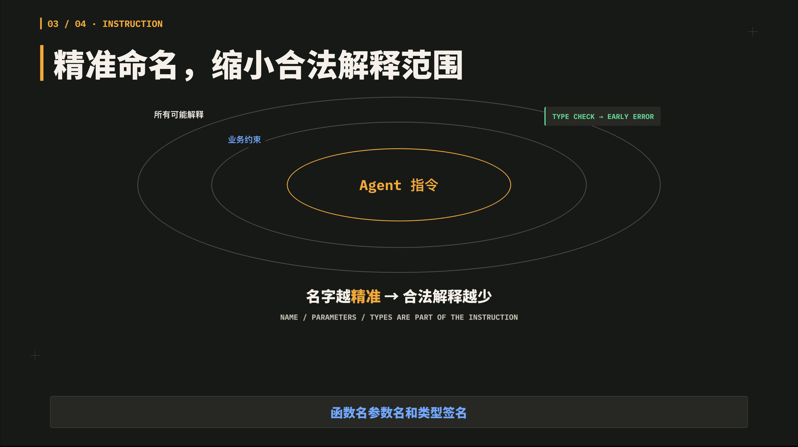
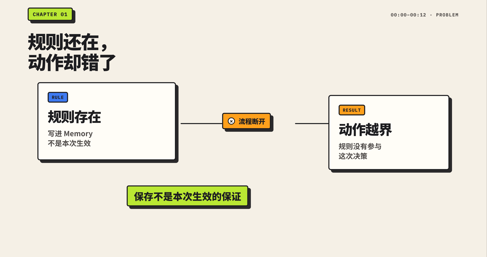
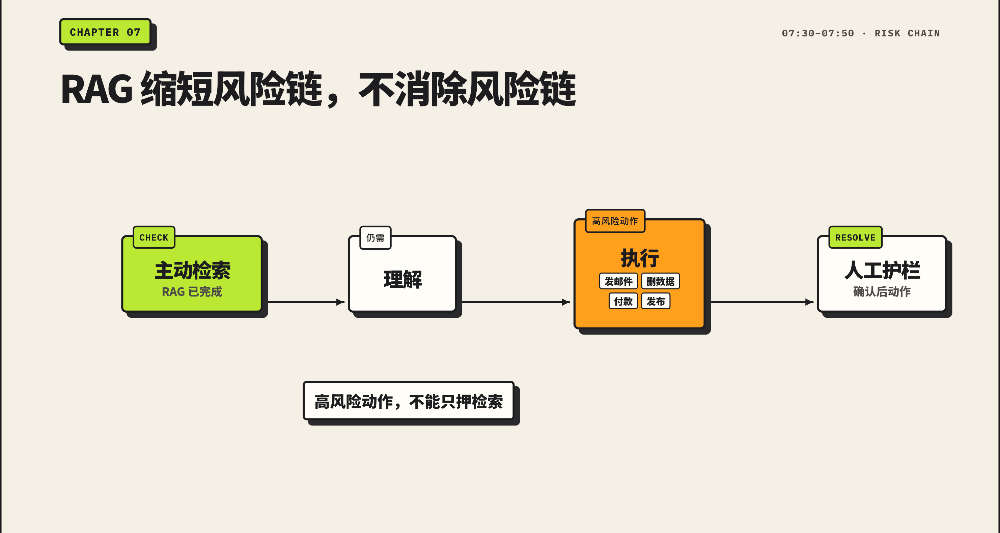
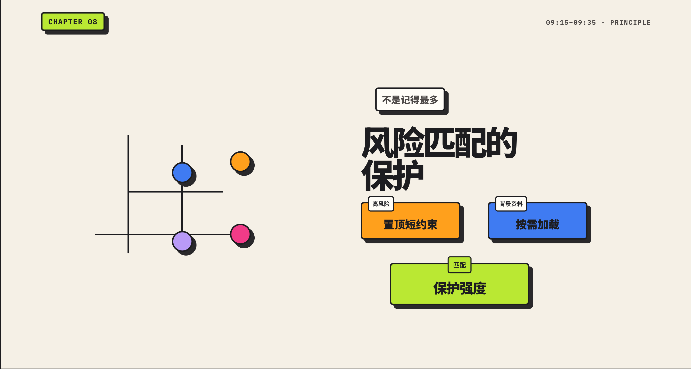

# Video methods

此目录只放可跨项目复用、适合公开分享的视频方法资产。

## styles

视觉样式与设计系统，例如颜色 token、字体层级、字幕安全区、动效语言和明确禁用项。它回答的是：画面怎样保持同一种风格。

新建派生规范时，从 styles/templates/DESIGN.template.md 复制开始；不要把项目专属内容写回默认 DESIGN.md。

### 样式预览

每种样式规范在 `styles/previews/<样式名>/` 下存放示例帧截图，用于直观展示该规范的画面效果。

#### Graphite Rule Console（[DESIGN.md](styles/DESIGN.md)）

  
  
  

#### Sticker Workbench（[DESIGN.sticker-workbench.md](styles/DESIGN.sticker-workbench.md)）

  
  
  

## storyboards

分镜方法、镜头语法和验收模板。它回答的是：一个镜头如何完成一个观众能带走的结论。

具体项目应在自身仓库中复制这些文档，再填写项目专属的旁白、时长、素材与镜头内容。
